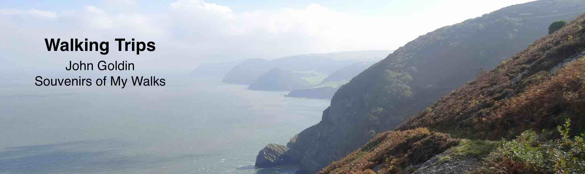

### Use This to Setup Walks


```{r setup_code, echo = FALSE, message = FALSE, warning = FALSE}
library("rgdal")
library("lubridate")
library("plyr")
library("dplyr")
library("ggplot2")
library("leaflet")
library("stringr")
library("RColorBrewer")
library("httr")
library("jsonlite")
load(file = "flickr_values.RData") # to get user_id and api_key for flickr calls
source("flickr_calls.R")
source("map_from_folder.R")
source("add_gpx_to_leaflet.R")
source("elevation_from_folder.R")
source("map_trip.R")
```
```{r create_england, echo = FALSE, message = FALSE, include = FALSE, fig.height = 9, warning=FALSE}
photoIcon <- makeIcon(
  iconAnchorX = 12, iconAnchorY = 12, # center middle of icon on track,
  # iconWidth = 64, iconHeight = 64,
  # iconAnchorX = 32, iconAnchorY = 32, # center middle of icon on track,
  # instead of top corner  
  #iconUrl = "https://www.mapbox.com/maki/renders/camera-12@2x.png"
  #iconUrl <- "http://icons.iconarchive.com/icons/icons8/ios7/24/Photo-Video-Slr-Camera2-Filled-icon.png"
  #iconUrl = "25.camera-front.png"  wrong size
  #iconUrl = "camera-icon-33-24px.png"
  iconUrl = "camera-icon-35-24px.png" # from: http://www.freeiconspng.com/free-images/camera-icon-35
)
redo <- TRUE
if (!redo) load("england_trips2.RData")
if (redo) {
  # let's do it again, this time save everthing into one map
  all_england <- map_trip(NULL, "2011 Hadrians Wall", use_api_key = api_key, 
                            use_user_id = user_id,
                            add_camera_gps = FALSE, adjust_camera_time = 5 * 60 * 60)
  north_england_bbox <- all_england$trip_bbox
  trips_df <- data_frame(area = c("England"), trip = c("Hadrians Wall"), year = c(2011),
                         bbox11 = all_england$trip_bbox[1, 1], bbox12 = all_england$trip_bbox[1, 2],
                         bbox21 = all_england$trip_bbox[2, 1], bbox22 = all_england$trip_bbox[2, 2])
  all_england <- map_trip(all_england, "Coast to Coast", use_api_key = api_key, use_user_id = user_id,
                            add_camera_gps = FALSE, adjust_camera_time = -1 * 60 * 60)
  north_england_bbox <- revise_bbox(north_england_bbox, all_england$trip_bbox)
  trips_df <- bind_rows(trips_df, data_frame(area = c("England"), trip = c("Coast to Coast"), year = c(2012),
                         bbox11 = all_england$trip_bbox[1, 1], bbox12 = all_england$trip_bbox[1, 2],
                         bbox21 = all_england$trip_bbox[2, 1], bbox22 = all_england$trip_bbox[2, 2]))
  all_england <- map_trip(all_england, "2014 Pennine Way", use_api_key = api_key, 
                            use_user_id = user_id, 
                            add_camera_gps = FALSE, adjust_camera_time = 0)
  north_england_bbox <- revise_bbox(north_england_bbox, all_england$trip_bbox)
  trips_df <- bind_rows(trips_df, data_frame(area = c("England"), trip = c("Pennine Way north"), year = c(2014),
                         bbox11 = all_england$trip_bbox[1, 1], bbox12 = all_england$trip_bbox[1, 2],
                         bbox21 = all_england$trip_bbox[2, 1], bbox22 = all_england$trip_bbox[2, 2]))
  all_england <- map_trip(all_england, "2013 Pennine Way", use_api_key = api_key, use_user_id = user_id,
                            add_camera_gps = FALSE, adjust_camera_time = -60 * 60)
  pennine_way_south_bbox <- all_england$trip_bbox
  trips_df <- bind_rows(trips_df, data_frame(area = c("England"), trip = c("Pennine Way south"), year = c(2013),
                         bbox11 = all_england$trip_bbox[1, 1], bbox12 = all_england$trip_bbox[1, 2],
                         bbox21 = all_england$trip_bbox[2, 1], bbox22 = all_england$trip_bbox[2, 2]))
  all_england <- map_trip(all_england, "2015 SWCP", 
                            use_api_key = api_key, use_user_id = user_id,
                            add_camera_gps = FALSE, adjust_camera_time = -60 * 60)
  swcp_bbox <- all_england$trip_bbox
  
    # This last trip was saved via myTracks at a rate one point per second (17,775 points) so loads very slowly
  all_england <- map_trip(all_england, "2015 SWCP last day", album = "2015 SWCP", 
                             use_api_key = api_key, use_user_id = user_id, 
                             adjust_camera_time = -60 * 60)  #Save the bounding box after these three trips:
  swcp_bbox <- revise_bbox(swcp_bbox, england_trips$trip_bbox)
  trips_df <- bind_rows(trips_df, data_frame(area = c("England"), trip = c("South West Coast Path"), year = c(2015),
                         bbox11 = swcp_bbox[1, 1], bbox12 = swcp_bbox[1, 2],
                         bbox21 = swcp_bbox[2, 1], bbox22 = swcp_bbox[2, 2]))
  all_england <- map_trip(all_england, "2012 Wales", use_api_key = api_key, use_user_id = user_id,
                            add_camera_gps = FALSE, adjust_camera_time = -1 * 60 * 60)
  wales_bbox <- all_england$trip_bbox
  trips_df <- bind_rows(trips_df, data_frame(area = c("England"), trip = c("Wales"), year = c(2011),
                         bbox11 = all_england$trip_bbox[1, 1], bbox12 = all_england$trip_bbox[1, 2],
                         bbox21 = all_england$trip_bbox[2, 1], bbox22 = all_england$trip_bbox[2, 2]))
  all_england <- map_trip(all_england, "2012 Cotswolds", use_api_key = api_key, use_user_id = user_id,
                            add_camera_gps = FALSE, adjust_camera_time = 4 * 60 * 60)
  cotswolds_bbox <- revise_bbox(wales_bbox, all_england$trip_bbox)
  trips_df <- bind_rows(trips_df, data_frame(area = c("England"), trip = c("Cotswolds"), year = c(2011),
                         bbox11 = all_england$trip_bbox[1, 1], bbox12 = all_england$trip_bbox[1, 2],
                         bbox21 = all_england$trip_bbox[2, 1], bbox22 = all_england$trip_bbox[2, 2]))
  # I'll include Amsterdam trip here because it's not so far from England and was part of 2011 UK trip.
  all_england <- map_trip(all_england, "2011 Amsterdam", use_api_key = api_key, use_user_id = user_id,
                             add_camera_gps = FALSE, adjust_camera_time = 5 * 60 * 60)
  trips_df <- bind_rows(trips_df, data_frame(area = c("England"), trip = c("Amsterdam"), year = c(2011),
                         bbox11 = all_england$trip_bbox[1, 1], bbox12 = all_england$trip_bbox[1, 2],
                         bbox21 = all_england$trip_bbox[2, 1], bbox22 = all_england$trip_bbox[2, 2]))
  # recover the bbox matrix from df like so:
  # matrix(data = trips_df[1, c("bbox11", "bbox12", "bbox21", "bbox22")], nrow = 2, ncol = 2)
  england_trips_df <- trips_df
  save(all_england, england_trips_df, file = "all englands before added photos.RData")
  # load("all englands before added photos.RData")
  all_england$map <- map_photos(all_england$map, "Other UK", use_api_key = api_key, use_user_id = user_id) %>%
      addLayersControl(baseGroups = c("Topographical", "Road map", "Satellite"),
                       overlayGroups = c("Hiking routes", "Photo markers"),
                       options = layersControlOptions(collapsed = FALSE)) 
  england_trips_df$bbox11[england_trips_df$trip == "Coast to Coast"] <- -3.626556
  england_trips_df$bbox12[england_trips_df$trip == "Coast to Coast"] <- -1.769334
  england_trips_df$bbox12[england_trips_df$trip == "Hadrians Wall"] <- -1.612492

  save(all_england, england_trips_df, file = "all_england.RData")

```
```{r print_england, echo = FALSE, warning=FALSE, message=FALSE}
# # Layers control
# map_photos(england_trips2$map, "Other UK", use_api_key = api_key, use_user_id = user_id) %>%
#         addLayersControl(baseGroups = c("Topographical", "Road map", "Satellite"),
#                          #overlayGroups = c("Hiking routes"),
#                          #overlayGroups = c("Hiking routes", "Photo markers", "Camera GPS"),
#                          overlayGroups = c("Hiking routes", "Photo markers", "Other trips"),
#                          options = layersControlOptions(collapsed = FALSE)) %>%
#         fitBounds(bbox_save[1, 1], bbox_save[2, 1], 
#                   bbox_save[1, 2], bbox_save[2, 2])

```

#### Bryce and the Grand Canyon
I have GPS traces of two walks at Bryce Canyon and two at the North Rim of the Grand Canyon in 2013.
For this trip we flew into Las Vegas and drove up through St. George, Utah. In the initial view
of the map below, there is one cluster of photo icons in the north at Bryce and then a second
cluster to the south at the North Rim of the Grand Canyon. These were not long walks and
this is a less interesting use of this technicque than the multi-day walks in England.
But it still can be fun for me to look at some of the detail. For example, if one zooms into the
Grand Canyon area there's a photo icon at the cabin near the Lodge where we stayed. I can
see it clearly on the terrain map. We were there for three days and each day we would walk
down the short path to Bright Angel Point below the lodge.

```{r create_canyons, echo = FALSE, message = FALSE, include = FALSE, warning=FALSE}
if (!redo) load("the_canyons.RData")
if (redo) {
  usa_map <- map_trip(NULL, "2013 Bryce", use_api_key = api_key, use_user_id = user_id,
                          album_name = "2013 Utah",
                          add_camera_gps = FALSE, adjust_camera_time = -60 * 60)
  usa_df <- data_frame(area = c("USA"), trip = c("Bryce"), year = c(2013),
                         bbox11 = usa_map$trip_bbox[1, 1], bbox12 = usa_map$trip_bbox[1, 2],
                         bbox21 = usa_map$trip_bbox[2, 1], bbox22 = usa_map$trip_bbox[2, 2])
  usa_map <- map_trip(usa_map, "2016 Grand Canyon", use_api_key = api_key, use_user_id = user_id,
                          album_name = "2016 Grand Canyon",
                          adjust_camera_time = 7 * 60 * 60)
  usa_df <- bind_rows(usa_df, data_frame(area = c("USA"), trip = c("Grand Canyon"), year = c(2016),
                         bbox11 = usa_map$trip_bbox[1, 1], bbox12 = usa_map$trip_bbox[1, 2],
                         bbox21 = usa_map$trip_bbox[2, 1], bbox22 = usa_map$trip_bbox[2, 2]))
  usa_map <- map_trip(usa_map, "2013 Grand Canyon", use_api_key = api_key, 
                          album_name = "2013 Utah",
                          use_user_id = user_id, 
                          add_camera_gps = FALSE, adjust_camera_time = 4 * 60 * 60)
  usa_df <- bind_rows(usa_df, data_frame(area = c("USA"), trip = c("Grand Canyon"), year = c(2013),
                         bbox11 = usa_map$trip_bbox[1, 1], bbox12 = usa_map$trip_bbox[1, 2],
                         bbox21 = usa_map$trip_bbox[2, 1], bbox22 = usa_map$trip_bbox[2, 2]))
  usa_map <- map_trip(usa_map, "2013 Yosemite", use_api_key = api_key, use_user_id = user_id,
                       add_camera_gps = FALSE, adjust_camera_time = 7 * 60 * 60)
  usa_df <- bind_rows(usa_df, data_frame(area = c("USA"), trip = c("Yosemite"), year = c(2013),
                         bbox11 = usa_map$trip_bbox[1, 1], bbox12 = usa_map$trip_bbox[1, 2],
                         bbox21 = usa_map$trip_bbox[2, 1], bbox22 = usa_map$trip_bbox[2, 2]))
  usa_map <- map_trip(usa_map, "2014 Tucson", use_api_key = api_key, use_user_id = user_id,
                      add_camera_gps = FALSE, adjust_camera_time = 7 * 60 * 60)
  usa_df <- bind_rows(usa_df, data_frame(area = c("USA"), trip = c("Tucson"), year = c(2014),
                         bbox11 = usa_map$trip_bbox[1, 1], bbox12 = usa_map$trip_bbox[1, 2],
                         bbox21 = usa_map$trip_bbox[2, 1], bbox22 = usa_map$trip_bbox[2, 2]))
  usa_map <- map_trip(usa_map, "2015 Phoenix", use_api_key = api_key, use_user_id = user_id,
                      add_camera_gps = FALSE, adjust_camera_time = 6 * 60 * 60)
  usa_df <- bind_rows(usa_df, data_frame(area = c("USA"), trip = c("Phoenix"), year = c(2015),
                         bbox11 = usa_map$trip_bbox[1, 1], bbox12 = usa_map$trip_bbox[1, 2],
                         bbox21 = usa_map$trip_bbox[2, 1], bbox22 = usa_map$trip_bbox[2, 2]))
  save(usa_map, usa_df, file = "usa before other photos.RData")
  # load("usa before other photos.RData")

  usa_map$map <- map_photos(usa_map$map, "Other USA", use_api_key = api_key, use_user_id = user_id) %>%
        addLayersControl(baseGroups = c("Topographical", "Road map", "Satellite"),
                         #overlayGroups = c("Hiking routes"),
                         #overlayGroups = c("Hiking routes", "Photo markers", "Camera GPS"),
                         overlayGroups = c("Hiking routes", "Photo markers"),
                         options = layersControlOptions(collapsed = FALSE)) 
  save(usa_map, usa_df, file = "usa.RData")
}
```


```

#### The Pyrenees - 2014
I had a rental car in Catalonia in 2014 and did three one-day walks recommended in the 
Lonely Planet Guide to Walking in Spain.
One was near the town of Soldeu in Andorra. Andorra is a small principality in the mountains between
Catalonia (Spain) and France. It seems to be a combination ski resort and tax haven.
The only city is Andorra la Vella and is a remarkable place. And not in a good way.
Fortunately Soldeu is up the valley a ways and somewhat out of the crush of the city.
The walk is directly north of the village and goes up into a lovely alpine valley.

After two nights in Soldeu I  moved onto the village of Espot and did two walks in
the Parc Nacional de Aigüestortes i Estany de Sant Maurici. For one walk I had to take
a jeep from the village to the lake at the start of the trail. (That's the walk at the western
end of this map). The other walk started in the village and went directly to the south. It was
October and there was some nice fall foliage.

```{r create_pyrenees, echo = FALSE, message = FALSE, include = FALSE, warning=FALSE}
if (!redo) load("pyrenees.RData")
if (redo) {
  spain <- map_trip(NULL, "2014 Pyrenees", use_api_key = api_key, use_user_id = user_id,
                       album_name = "2014 Catalonia",
                       add_camera_gps = FALSE, adjust_camera_time = -60 * 60)
  spain_df <- data_frame(area = c("Spain"), trip = c("Pyrenees"), year = c(2014),
                         bbox11 = spain$trip_bbox[1, 1], bbox12 = spain$trip_bbox[1, 2],
                         bbox21 = spain$trip_bbox[2, 1], bbox22 = spain$trip_bbox[2, 2])
  spain <- map_trip(spain, "2015 Cabo de Gata", use_api_key = api_key, use_user_id = user_id,
                         add_camera_gps = FALSE, adjust_camera_time = -2 * 60 * 60)
  spain_df <- bind_rows(spain_df, data_frame(area = c("Spain"), trip = c("Cabo de Gata"), year = c(2015),
                         bbox11 = spain$trip_bbox[1, 1], bbox12 = spain$trip_bbox[1, 2],
                         bbox21 = spain$trip_bbox[2, 1], bbox22 = spain$trip_bbox[2, 2]))
  spain <- map_trip(spain, "2014 Andorra", use_api_key = api_key, use_user_id = user_id,
                         add_camera_gps = FALSE, adjust_camera_time = -2 * 60 * 60)
  spain_df <- bind_rows(spain_df, data_frame(area = c("Spain"), trip = c("Andorra"), year = c(2014),
                         bbox11 = spain$trip_bbox[1, 1], bbox12 = spain$trip_bbox[1, 2],
                         bbox21 = spain$trip_bbox[2, 1], bbox22 = spain$trip_bbox[2, 2]))
  spain <- map_trip(spain, "2014 Cadaques", use_api_key = api_key, use_user_id = user_id,
                         add_camera_gps = FALSE, adjust_camera_time = -2 * 60 * 60)
  spain_df <- bind_rows(spain_df, data_frame(area = c("Spain"), trip = c("Cadaques"), year = c(2014),
                         bbox11 = spain$trip_bbox[1, 1], bbox12 = spain$trip_bbox[1, 2],
                         bbox21 = spain$trip_bbox[2, 1], bbox22 = spain$trip_bbox[2, 2]))
  spain <- map_trip(spain, "2015 Madrid", use_api_key = api_key, use_user_id = user_id,
                         add_camera_gps = FALSE, adjust_camera_time = -2 * 60 * 60)
  spain_df <- bind_rows(spain_df, data_frame(area = c("Spain"), trip = c("Madrid"), year = c(2015),
                         bbox11 = spain$trip_bbox[1, 1], bbox12 = spain$trip_bbox[1, 2],
                         bbox21 = spain$trip_bbox[2, 1], bbox22 = spain$trip_bbox[2, 2]))
  spain <- map_trip(spain, "2015 Andalusia", use_api_key = api_key, use_user_id = user_id,
                         add_camera_gps = FALSE, adjust_camera_time = -2 * 60 * 60)
  spain_df <- bind_rows(spain_df, data_frame(area = c("Spain"), trip = c("Andalusia"), year = c(2015),
                         bbox11 = spain$trip_bbox[1, 1], bbox12 = spain$trip_bbox[1, 2],
                         bbox21 = spain$trip_bbox[2, 1], bbox22 = spain$trip_bbox[2, 2]))
  save(spain, spain_df, file = "spain before add photos.RData")
  # load("spain before add photos.RData")
  spain$map <- map_photos(spain$map, "Other Spain", use_api_key = api_key, use_user_id = user_id) %>%
        addLayersControl(baseGroups = c("Topographical", "Road map", "Satellite"),
                         #overlayGroups = c("Hiking routes"),
                         #overlayGroups = c("Hiking routes", "Photo markers", "Camera GPS"),
                         overlayGroups = c("Hiking routes", "Photo markers"),
                         options = layersControlOptions(collapsed = FALSE)) 
  save(spain, spain_df, file = "spain.RData")
}
```
```{r print_pyrenees, echo = FALSE}
map_photos(pyrenees$map, NULL, use_api_key = api_key, use_user_id = user_id) %>%
        addLayersControl(baseGroups = c("Topographical", "Road map", "Satellite"),
                         #overlayGroups = c("Hiking routes"),
                         #overlayGroups = c("Hiking routes", "Photo markers", "Camera GPS"),
                         overlayGroups = c("Hiking routes", "Photo markers", "Other trips"),
                         options = layersControlOptions(collapsed = FALSE)) %>%
        fitBounds(pyrenees$bbox_trip[1, 1], pyrenees$bbox_trip[2, 1], 
                  pyrenees$bbox_trip[1, 2], pyrenees$bbox_trip[2, 2])
```

#### Tucson and Phoenix
These are shorter walks at Xmas in 2014 and 2015.
This map initially focuses on three walks north of Phoenix, but if you zoom out you can scroll down
to Tucson and see two walks there. Both are in the western section of Saguaro National Park. In
one the trace starts at the visitor's center and then includes are drive to the start of a nearby trail.
The other starts east of the Tucson Mountains and show a there-and-back route up Wasson Peak.

```{r create_arizona, echo = FALSE, message = FALSE, include = FALSE, warning=FALSE}
if (!redo) load("arizona.RData")
if (redo) {
  arizona <- map_trip(NULL, "2014 Tucson", use_api_key = api_key, use_user_id = user_id,
                      add_camera_gps = FALSE, adjust_camera_time = 7 * 60 * 60)
  arizona <- map_trip(arizona, "2015 Phoenix", use_api_key = api_key, use_user_id = user_id,
                      add_camera_gps = FALSE, adjust_camera_time = 6 * 60 * 60)
  save(arizona, file = "arizona.RData")
}
```
```{r print_arizona, echo = FALSE}
        addLayersControl(arizona$map, baseGroups = c("Topographical", "Road map", "Satellite"),
                         #overlayGroups = c("Hiking routes"),
                         #overlayGroups = c("Hiking routes", "Photo markers", "Camera GPS"),
                         overlayGroups = c("Hiking routes", "Photo markers", "Other trips"),
                         options = layersControlOptions(collapsed = FALSE)) %>%
        fitBounds(arizona$bbox_trip[1, 1], arizona$bbox_trip[2, 1], 
                  arizona$bbox_trip[1, 2], arizona$bbox_trip[2, 2])
```

#### Cabo de Gata, Andalusia, Spain 2015
I did three short walks in El Cabo de Gata Natural Park in Spain. It's a desert area. It has
provided the background for many movies including Lawrence of Arabia and some spaghetti westerns.
All three walks followed the short of the Mediterranean. I stayed four nights in San Joseé.

```{r create_cabodegata, echo = FALSE, message = FALSE, include = FALSE, warning=FALSE}
if (!redo) load("cabodegata.RData")
if (redo) {
  cabodegata <- map_trip(NULL, "2015 Cabo de Gata", use_api_key = api_key, use_user_id = user_id,
                         add_camera_gps = FALSE, adjust_camera_time = -2 * 60 * 60)
  save(cabodegata, file = "cabodegata.RData")
}
```
```{r print_cabodegata, echo = FALSE}
        addLayersControl(cabodegata$map, baseGroups = c("Topographical", "Road map", "Satellite"),
                         #overlayGroups = c("Hiking routes"),
                         #overlayGroups = c("Hiking routes", "Photo markers", "Camera GPS"),
                         overlayGroups = c("Hiking routes", "Photo markers", "Other trips"),
                         options = layersControlOptions(collapsed = FALSE)) %>%
        fitBounds(cabodegata$bbox_trip[1, 1], cabodegata$bbox_trip[2, 1], 
                  cabodegata$bbox_trip[1, 2], cabodegata$bbox_trip[2, 2])
```


#### Amsterdam 2011
Next let's try showing me wandering around Amsterdam. I was there for a 23 hour layover flying back
from Manchester to Boston. My sisters suggested I should grab the chance for a brief visit.
There's good train service between Schiphol Airport and the grand [Amsterdam Central Station](http://www.amsterdam.info/central-station/). I stayed overnight in the quirky
[A-Train Hotel](http://www.atrainhotel.com/) just across from Central Station. Many of the photos
were taken during a boat tour on the canals.

```{r create_amsterdam, echo = FALSE, message = FALSE, include = FALSE, warning=FALSE}
if (!redo) load("amsterdam.RData")
if (redo) {
  amsterdam <- map_trip(NULL, "2011 Amsterdam", use_api_key = api_key, use_user_id = user_id,
                             add_camera_gps = FALSE, adjust_camera_time = 5 * 60 * 60)
  save(amsterdam, file = "amsterdam.RData")
}
```
```{r print_amsterdam, echo = FALSE}
        addLayersControl(amsterdam$map, baseGroups = c("Topographical", "Road map", "Satellite"),
                         #overlayGroups = c("Hiking routes"),
                         #overlayGroups = c("Hiking routes", "Photo markers", "Camera GPS"),
                         overlayGroups = c("Hiking routes", "Photo markers", "Other trips"),
                         options = layersControlOptions(collapsed = FALSE)) %>%
        fitBounds(amsterdam$bbox_trip[1, 1], amsterdam$bbox_trip[2, 1], 
                  amsterdam$bbox_trip[1, 2], amsterdam$bbox_trip[2, 2])
```

#### Madrid 2015
In the spirit of the Amsterdam map, here's my afternoon in Madrid. I took a train from
Granada and did some unsystematic touring in the vicinity of my hotel.

```{r create_madrid, echo = FALSE, message = FALSE, include = FALSE, warning=FALSE}
if (!redo) load("madrid.RData")
if (redo) {
  madrid <- map_trip(NULL, "2015 Madrid", use_api_key = api_key, use_user_id = user_id,
                           add_camera_gps = FALSE, adjust_camera_time = -2 * 60 * 60)
  save(madrid, file = "madrid.RData")
}
```
```{r print_madrid, echo = FALSE}
        addLayersControl(madrid$map, baseGroups = c("Topographical", "Road map", "Satellite"),
                         #overlayGroups = c("Hiking routes"),
                         #overlayGroups = c("Hiking routes", "Photo markers", "Camera GPS"),
                         overlayGroups = c("Hiking routes", "Photo markers", "Other trips"),
                         options = layersControlOptions(collapsed = FALSE)) %>%
        fitBounds(madrid$bbox_trip[1, 1], madrid$bbox_trip[2, 1], 
                  madrid$bbox_trip[1, 2], madrid$bbox_trip[2, 2])
```


#### Elevation Profile for Walks
I have also done some experiments with elevation plots from the GPS trace. These plots show
the change in elevation during the course of the day's walk. 
The distance along the x-axis of these plots is probably overstated, possibly by 10%. Errors in
the GPS data is interpreted as actual movement. The x-axis is the cumulative distance between
each successive point and there are more than 2,000 data points for each day's walk. 

Here is an example of an elevation plot for the three walks in the Pyrenees. A thousand meters is 3,280 feet.
```{r elevation_pyrenees, echo = FALSE}
print(elevation_from_hikes(pyrenees$hikes))
```
   
 
### Some Technical Notes

This document is created in R using [RStudio](https://www.rstudio.com/)'s knitr and
[markdown](http://rmarkdown.rstudio.com/) to create HTML output. RStudio also provides the RPub area so that I can easily publish the HTML output to the web.
The basic technique to create the map is based on the [example](http://mhermans.net/hiking-gpx-r-leaflet.html) provided by Maarten Hermans.
The map uses [R htmlwidgets](http://www.htmlwidgets.org/) 
that provide access to the Javascript tool [Leaflet](http://leafletjs.com/).
The trick is that I don't have to know very much about either htmlwidgets or
Leaflet to make this work. 

Maarten relies on the package rgdal to deal with mapping issues. [GDAL -- Geospatial Data Abstraction Library](http://www.gdal.org/) is a [big topic](http://www.osgeo.org/gdal_ogr).
I had used it previously to convert map coordinates from the projection used in Great Britain
to WGS84, the projection used in the US, Google Earth, and Open Street Maps. Via Maarten's
example I learned that I could use an rgdal function (readOGR) to load in GPS tracks in the GPX format.
With a bit of googling I picked up a couple of other useful tools. But I still have the 
barest understanding of what's involved with GDAL (and the [sp](https://cran.r-project.org/web/packages/sp/vignettes/intro_sp.pdf)
package that relies on rgdal). 
Back when I was first using rgdal I had
some problems properly installing the gdal C libraries on OSX. It took a fair amount of googling to
get that sorted out. 

The example by Maarten displayed photos from his local server. I wanted to
use photos that I had already uploaded to [Flickr](https://www.flickr.com/). There is
an API to access Flickr, but at first I had a lot of trouble figuring out how to 
use it from R. 
There is an Rflickr package, but it appears to be out of date and no longer
functions. Once again googling led me to an [example](http://timelyportfolio.github.io/rCharts_Rflickr/iso_httr.html) 
that unlocked the technique to use the Flickr API from R. As typically happens,
this led me into a couple of other technical byways. I used the package 
[httr](https://cran.r-project.org/web/packages/httr/index.html) to interact with
the Flickr API. Data is returned via JSON. I had heard of that before, but didn't 
really understand its purpose. This led me into the package [jsonlite](https://cran.r-project.org/web/packages/jsonlite/vignettes/json-aaquickstart.html).
Once I got rolling with the Flickr API I realized that it was very effective and
easy to use. Flickr sends me the URL for my pictures and I am able to put that URL
into the popup markers that appear on the Leaflet map. The pre-sized photos are only
downloaded from Flickr as needed so they popup very quickly.

My camera has a GPS and many of my photos are geotagged (depending on whether the camera
had enough time to get a GPS fix). But for the camera icons on the GPS trace I did not rely
on the GPS info from the camera. Instead I matched the time of the photo with the time 
of the points on the GPS trace. This works quite well. The GPS records time in universal (i.e. Greenwich) time while
the camera generally records the time in the local time zone. I had to adjust for those time
difference and sometimes adjust for the fact that in some cases I had the camera
set on a wacky time zone.

As always my R code relies on the suite of packages created by [Hadley Wickham](http://priceonomics.com/hadley-wickham-the-man-who-revolutionized-r/). I operate in the [Hadleyverse](http://adolfoalvarez.cl/the-hitchhikers-guide-to-the-hadleyverse/).
For this project httr was yet another hadleyverse package that turned out to do exactly what
I needed to do even before I knew I needed it to cope with the Flickr API.

There are a number tools that put photos on a map with an 
effect similar to what is displayed here. [Panoramio](http://www.panoramio.com/) is
an elaborate site for placing photos on Google maps and related to things Google does
in Google Earth. Flickr has some views that emphasize [photos located on maps](https://www.flickr.com/map). If you have
a photo that is tagged with longitude and latitude Flickr will show a map view showing other
photos in the same location. It is interesting to note that the Flickr map views
also rely on the same Leaflet technology used for this project. (Leaflet is more commonly
used with languages other than R.)

Eventually I may get around to posting the actual R code.

-- John Goldin   at gmail, john.r.goldin


